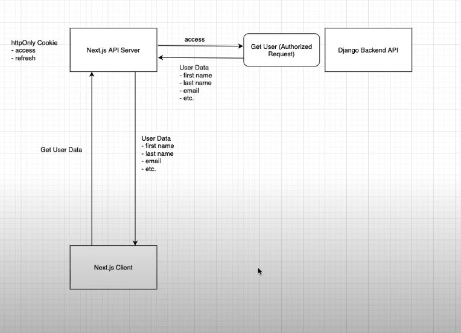

## auth system explained

## QUICK NOTE

I use .js for the files that contains only the js logics like calling the api . 

and .jsx for the files with layout and html code like pages and components.
